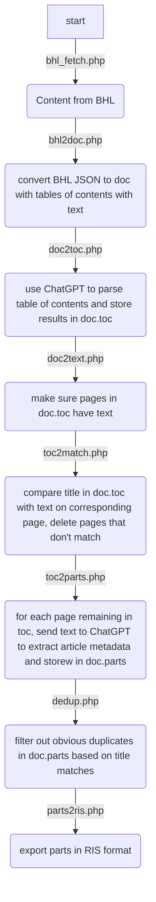
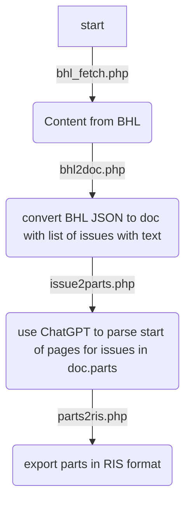
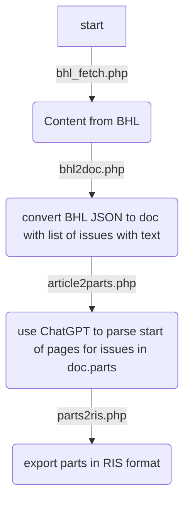

# AI article extractor

This repo contains code for exploring how to use tools such as ChatGPT to help locate and extract articles from whole volumes, such as BHL scans, PDFs for journal issues, etc.

Unlike, say, document layout analysis, here the challenge is to locate individual documents (articles, book chapters) within a larger document.

## Approaches

The first attempt combines text-matching with ChatGPT to mimic how someone might do this manually. We locate the table of contents in a volume, we then attempt to parse it so that we have a list of articles (or chapters) and we know where they start. We then use string matching to check that the title of each item in the table of contents is also in the text of the page where it starts in the document. If we get a match, we then  attempt to extract the metadata for that article. 

The parsing steps (table of contents, article/chapter metadata) are traditionally where we would use regular expressions, but here I use ChatGPT, asking it to extract data and return the results in JSON format.

## BHL Workflow

### Articles from tables of contents

- `bhl_fetch.php` get metadata for BHL title and its items
- `bhl2doc.php` for an item create a simple JSON document listing the pages with basic metadata and output the document as `<ItemID>.json`. We use BHL page types as tags for the the pages, store the BHL page number (if present), and the PageID as the `id` for the page. The index of pages that are flagged as tables of contents are added to an array `contents_pages`. We make sure we have OCR text extracted for these pages by calling the BHL API. In practice I have found that using the Mac’s built in OCR is a quick way to improve the quality of the OCR text, see https://github.com/xulihang/macOCR.
- `doc2toc.php <filename>` for a given document will use ChatGPT to parse the table of contents into structured data. Each conversation with ChatGPT is saved to disk in `chat-cache` to keep costs down. Each item in the table of contents is stored in the `toc` array.
- `doc2text.php <filename>` takes the `toc` array and ensures that any page listed in the table of contents has text available. We could just download text for all BHL pages, but this gets tedious, hence we just download the text that we need.
- `toc2match.php <filename>` takes the pages in `toc` and checks that the title text in the table of contents item also occurs on the corresponding page in the document. For example, if the table of contents says there is an article “Inquérito bacteriológico de serpentes doentes e mortas mantidas em cativeiro” on p. 55, and the text on p. 55 includes that string, or something close to it, such as “INQUÉRITO BACTERIOLÓGICO DE SERPENTES DOENTES E MORTAS MANTIDAS EM CATIVEIRO” then we score that as a match. This idea comes from [doi:10.1109/icdar.2003.1227822](https://doi.org/10.1109/icdar.2003.1227822). If a item in the `toc` array doesn’t match we delete it from that array.
- `toc2parts.php <filename>` takes the pages in `toc` and uses ChatGPT to extract article-level metadata from that page. We then use any additional information we have, such as page numbers in the table of contents, journal name, ISSN, etc. to flesh out that metadata. Some tables of contents include both start and end pages for an article, but most don’t. We attempt to get that from the article metadata, failing that we use the page number of the next article as an upper bound on the ending page of the current article, decrementing that number by one (so we have the page number for the page just before the next article). We do a crude check to see if that page is blank, if se we decrement the page number again.
- `dedup.php <filename>` removes duplicate parts (articles/chapters) based on title summary. We can get duplicates because the tables of contents may be repeated more than once in a volume (e.g., on the cover and inside as well).
- `parts2ris.php <filename>` dumps the articles or chapters we have found to a RIS file (other formats are available).

### Articles from BHL-delimited issues in volume

#### Flagged  by “issue start” page, so each issue in a volume is an article

#### Flagged  by “article start” page, so each issue in a volume is an article

#### Table of contents has authors, title, date, spage and epage

For example, https://www.biodiversitylibrary.org/page/63843992

We can take a “punt” and assume matches are correct, but think about testing...

bhl2doc
doc2toc
doc2text
doc2parts
parts2ris

## Reading

- Jordy Van Landeghem, Sanket Biswas, Matthew B. Blaschko, Marie-Francine Moens (2023). Beyond Document Page Classification: Design, Datasets, and Challenges. [doi:10.48550/arXiv.2308.12896](https://doi.org/10.48550/arXiv.2308.12896)

- Xiaofan Lin. (n.d.). Text-mining based journal splitting. Seventh International Conference on Document Analysis and Recognition, 2003. Proceedings. [doi:10.1109/icdar.2003.1227822](https://doi.org/10.1109/icdar.2003.1227822)
